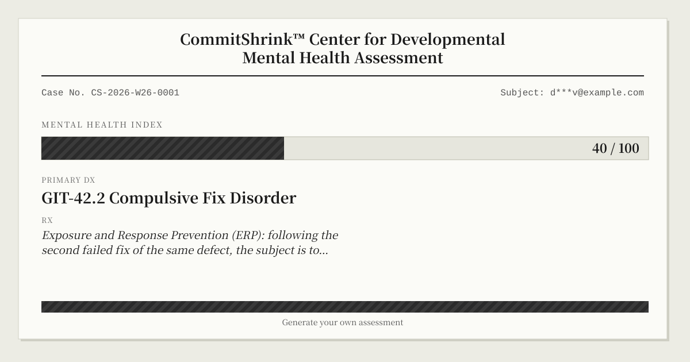

# CommitShrink

[](https://github.com/Anderson-ops-oss/CommitShrink/actions/workflows/tests.yml)
[](LICENSE)


**English** | [简体中文](README.zh-CN.md)

> A perfectly serious clinical instrument that reads your `git log` and returns a developer mental-health assessment — diagnostic codes, quantitative indicators, and a prescription you will not follow.

---

## Overview

CommitShrink is a clinical assessment instrument for developers who never asked to be assessed.

It ingests your `git log`, scores the emotional trajectory of every commit message, and cross-references your commit history against an internally validated symptom taxonomy. What comes out the other end is a full diagnostic report: a primary diagnosis, a battery of quantitative indicators, verbatim clinical evidence pulled from your own commit history, and a prescription you will not follow.

The sentiment-analysis techniques underneath are not novel — this has been done before, in academic papers and weekend projects alike. What CommitShrink contributes is commitment to the bit: the diagnostic codes, the deadpan clinical prose, the fictional norm database calibrated against 10,000 fictional developers, and a two-reviewer quality control sign-off performed by one program and a copy of itself.

**A note on language.** CommitShrink generates reports in English by default (`--lang en`) and in Chinese with `--lang zh`. The joke was built for a Chinese-language commit culture first, so the full symptom taxonomy in [`commit_shrink/data/symptoms.yaml`](commit_shrink/data/symptoms.yaml) is authored in Chinese, with the English copy overlaid from [`commit_shrink/data/locales/en.yaml`](commit_shrink/data/locales/en.yaml). The sample below is literal English tool output, regenerated from this repo's own git log — not a hand-written rendering. If you read Chinese, see [README.zh-CN.md](README.zh-CN.md).

## Sample Report (live)

The section below is not a mock-up — it's this repo's *own* CommitShrink assessment, regenerated weekly by [a GitHub Action](.github/workflows/update-readme-example.yml) straight from its git log. Its section layout follows the project's golden sample, [`docs/report-sample.md`](docs/report-sample.md), which defines exactly what a correct report must contain; generate your own with the demo repository below.

<!-- COMMITSHRINK:LIVE-EXAMPLE:START -->

_Regenerated automatically from this repo's own commits — last updated 2026-07-06 10:17 UTC._

## CommitShrink™ Center for Developmental Mental Health Assessment

**Periodic Psychological Status Assessment · Assessment Week 28**

| | |
|---|---|
| Subject | Anderson-ops-oss <u3606584@connect.hku.hk> |
| Assessment Period | 2026-06-30 — 2026-07-06 |
| Valid Sample | 20 commits (no exclusions; of which 0 low-information specimens have been included in the alexithymia statistics) |
| Administration Method | Non-invasive naturalistic behavioral observation (the subject was unaware of assessment during data generation; social-desirability bias = 0, Hawthorne effect = 0). |
| Assessment Instrument | CommitShrink v0.1 · cross-cultural reliability and validity established (n = 1) · test-retest reliability r = 1.00 |
| Report Date | 2026-07-06 18:17 (system-generated; no experimenter effect) |
| Report No. | CS-2026-W28-0001 |

---

### I. Overall Diagnosis

**Chief Complaint**: None. The subject denies any subjective distress and exhibits no help-seeking behavior; the sample was acquired at this center's own initiative.

**Primary Diagnosis**: GIT-55.4 Work-Life Boundary Dissolution (Extreme)
**Secondary Diagnosis**: GIT-36.6 Binge Committing (Silence-Purge Type) (Moderate)

**Composite Mental Health Score for this period: 77 / 100**
(+0 points versus last week)

**Clinical Impression**: The subject committed 20 times during this period, of which 1 occurred between 00:00 and 05:59. 

---

### II. Quantitative Indicators

| Indicator | This Period | Last Period | Reference Range | Norm Percentile |
| --- | --- | --- | --- | --- |
| Nocturnal Despair Index | **0.8** | 0.8 | < 3.0 | Higher than 16% of comparable samples |
| Work-Life Boundary Integrity | **38%** | 38% | > 70% | Lower than 81% of comparable samples |
| Emotional Baseline | **+0.17** | +0.17 | ≥ 0 | Lower than 33% of comparable samples |
| Fix-Loop Density | **1.7** | 1.7 | ≤ 2.0 | Higher than 46% of comparable samples |
| Commit Alexithymia Index | **0%** | 0% | < 15% | Higher than 20% of comparable samples |

<sub>Norms derived from this center's proprietary fictional normative database (n = 10,000 fictional developers). The fictional distribution has been carefully calibrated to ensure the subject retains ample room for improvement at all times.</sub>

---

### III. Symptom Episode Records (Selected Clinical Evidence)

#### Record 1 | GIT-55.4 Work-Life Boundary Dissolution · Severity IV (Extreme)

**Episode Window**: 07-04 00:10 – 18:29

```
07-04 00:10  445aae1  refactor: render report language at display time; add web language toggle
07-04 10:54  4b898dd  fix: use an emoji literal for the Streamlit page_icon
07-04 13:10  c781d8c  feat: clone remote repos blobless and backfill only the window's diff blobs
07-04 13:38  b5dd86c  feat: rotate playful waiting-room messages while the report generates
07-04 13:40  ab732e7  fix: type-clean EKG trough lookup and space the English trend clause
07-04 14:30  d3fb8ef  fix: drop dangling plan-commit-shrink.md references from docstrings
```

**Clinical Interpretation**: Weekend commits account for 55%. In the subject's temporal system, "the weekend" has degraded into a purely calendrical concept.

#### Record 2 | GIT-36.6 Binge Committing (Silence-Purge Type) · Severity II (Moderate)

**Episode Window**: 07-02 18:30

```
07-02 18:30  a9063b1  feat: add report generation module and sample report documentation
```

**Clinical Interpretation**: After ≥ 72 hours of silence, a single purge of changes across 15 files. This center has not yet observed a human sample capable of reviewing a change of that magnitude in one sitting.

---

### IV. Emotional EKG

| 06-30 | 07-01 | 07-02 | 07-03 | 07-04 | 07-05 | 07-06 |
| :---: | :---: | :---: | :---: | :---: | :---: | :---: |
| · | · | ███ | ▅▅▅ | ▅▅▅ | · | ▆▆▆ |

Emotional low point: 07-04 14:30 ("feat: add two disorders (GIT-45.0, GIT-00.1) and a shareable HTML card", corrected sentiment score -0.79)

---

### V. Prescription

1. The introduction of external constraints to restore the boundary is advised. This center does not recommend willpower-based interventions — a conclusion derived from a retrospective cohort study of the subject's prior medical record (git log).
2. Smaller commits are advised. The ideal size of a commit is the size the subject would dare to describe honestly in its message.
3. [Social Support] Restating the problem aloud to a rubber duck is advised. This center's research (unpublished, n = 1) indicates efficacy non-inferior to restating it to a colleague, with no incurred social debt.
4. [Referral Note] This center holds no prescribing authority. Caffeine intake falls outside the jurisdiction of this report and remains a matter between the subject and the subject's cardiologist.

---

### VI. Disclaimer & Follow-up

This report is generated by an automated system from the git log. It does not constitute medical advice, though it may constitute code-review advice. All "conditions" herein are a parody of the quantitative-assessment genre; certain diagnostic names are transplants of clinical terminology into the git domain. The subject of this report is the commit history, not any person, and it makes no reference to any real mental disorder or to any person affected by one. Should this report cause offense, please note that all clinical evidence was personally signed by the subject, at the time of the offense (git commit). This report is answerable only for the specimens submitted within the present assessment period; behavior outside the sample — including evidence destroyed via force-push — falls outside its scope. This center accepts only specimens submitted voluntarily by the subject; any diagnosis derived from specimens submitted on a colleague's behalf is void, and the act itself constitutes a condition this center has not yet coded.

**Follow-up**: Automatically scheduled upon the next git push.
**Quality Control**: This report has passed dual review (by this system and a copy of this system).
**Attending System**: CommitShrink v0.1 | License No. sha256:c0ffee…

<!-- COMMITSHRINK:LIVE-EXAMPLE:END -->

## How It Works

```
collector.py  →  analyzer.py  →  diagnoser.py  →  report.py
   git log        sentiment        symptom            render
   (1 pass)        scoring          matching
```

1. **Collector** reads your repository with a single `git log --numstat` pass — no external services, no network calls, nothing leaves your machine.
2. **Analyzer** scores every commit message's sentiment (VADER plus a hand-tuned bilingual lexicon patch) and computes the six headline metrics.
3. **Diagnoser** matches your commit patterns against a symptom table — every diagnosis, severity threshold, and prescription lives in [`commit_shrink/data/symptoms.yaml`](commit_shrink/data/symptoms.yaml) as data, not code.
4. **Report** renders the result as a full clinical write-up, either to the terminal or as an interactive Streamlit web report.

## Installation

Requires Python 3.10+.

**Run it without installing** — assess the current repo in one command:

```bash
pipx run commit-shrink .        # or:  uvx commit-shrink .
```

**Install it:**

```bash
pip install commit-shrink
```

(`pipx run` / `uvx` and `pip install` use the PyPI release, published by [the release workflow](.github/workflows/release.yml) on each `v*` tag.)

**From source** (for development):

```bash
git clone https://github.com/Anderson-ops-oss/CommitShrink.git
cd CommitShrink
```

Then create an environment with either `venv` or `conda`:

```bash
# venv
python -m venv .venv && source .venv/bin/activate
pip install -e .
```

```bash
# conda
conda create -n commit_shrink python=3.12 -y
conda activate commit_shrink
pip install -e .
```

If you ever move or rename the project directory, re-run `pip install -e .` inside the environment — an editable install records an absolute path to the source tree, and moving the directory without reinstalling leaves it pointing at a location that no longer exists.

## Usage

```bash
commit-shrink                                # assess the current directory, last 7 days
commit-shrink path/to/repo                   # assess a specific repository
commit-shrink . --days 30                    # widen the assessment window
commit-shrink . --author you@example.com     # assess a specific contributor
commit-shrink . --until 2026-06-28T23:59:00+08:00
commit-shrink . --card card.svg              # write a shareable SVG image card (.html also works)

# Assess a public repository without cloning it yourself first:
commit-shrink github:torvalds/linux --author torvalds@linux-foundation.org --days 7
commit-shrink https://github.com/owner/repo --author dev@example.com

# Assess a whole GitHub user — all their public repos, as one merged timeline:
commit-shrink gh-user:torvalds --author torvalds@linux-foundation.org --days 30

# Assess yourself, including PRIVATE repos (needs a token; see below):
export GITHUB_TOKEN=ghp_...        # or GH_TOKEN — or put it in a .env file (see below)
commit-shrink gh-user:@me --author you@example.com --days 30
```

Remote specs (a `github:owner/repo` shorthand, or any `https://`/`git@` clone URL) are cloned into a temporary directory as a *blobless partial clone* (full history metadata; file contents are fetched lazily, and only for the assessment window), then discarded afterward — nothing is left on disk. `--author` is required for a remote repository: without it there's no principled way to guess which contributor you meant to assess, so CommitShrink refuses to just pick whoever committed the most that week.

A `gh-user:<name>` spec goes one step further: it discovers the user's public repositories (owned, most-recently-pushed first), assesses them all as a *single merged commit timeline*, and anchors the cross-run trend to the person rather than any one repo — so the trend survives the user adding or archiving repos. `--author` is required here too (pass an email); the scope is the user's own public repos with activity in the window.

**Assessing yourself, including private repos.** `gh-user:@me` assesses *your own* repos — public **and** private — as one merged timeline. It needs a GitHub token in the environment (`GITHUB_TOKEN` or `GH_TOKEN`, never a command-line flag): a classic token with the `repo` scope, or a fine-grained token with **Contents: read** + **Metadata: read** on the repos you want covered. The token is passed to git via the environment, so it never appears in a URL, in `ps` output, or in your shell history; the history cache stores only diagnosis metadata (codes, scores), never code. A token is also useful on `gh-user:<someone-else>` — there it just lifts the anonymous 60-requests/hour rate limit (handy on a shared/NAT'd network like a campus), and never grants access to anyone else's private repos (GitHub enforces that server-side). You can check your remaining anonymous quota at `https://api.github.com/rate_limit`.

**`.env` file support.** Instead of exporting the token in every shell session, you can place it in a `.env` file at the root of your working directory — CommitShrink loads it automatically on startup:

```
# .env  (never commit this file)
GITHUB_TOKEN=ghp_...
```

The `.env` file is already listed in `.gitignore`. The token precedence is: existing shell environment → `.env` file.

Want to see it run without risking your own commit history? Generate a clinically rich demo repository and point the tool at it:

```bash
python scripts/make_fixture.py --path fixture-repo
```

The script builds its history around the most recently completed Mon–Sun week and prints the exact command to assess it, e.g.:

```bash
commit-shrink fixture-repo --days 7 --until 2026-06-28T23:59:00+08:00
```

Run the line it prints (the `--until` value depends on today's date) — `commit-shrink fixture-repo --days 7` on its own defaults to *today* as the window's end, which misses most of the demo history.

## Shareable Card

`--card <path>` writes a self-contained, one-page "discharge summary" — a case number, your Mental Health Index gauge, the primary diagnosis, and one prescription. The format follows the file extension: `card.svg` produces a 1200×630 **SVG image** that GitHub renders inline and that link-preview unfurlers can show, while `card.html` produces the interactive HTML card. Both embed no external assets, so they render offline; the Streamlit app shows the card inline with download buttons for either format.



## Web Interface

Prefer a browser? The same assessment pipeline is also available as a Streamlit app, with an interactive Plotly sentiment chart in place of the terminal's sparkline.

```bash
pip install -e ".[web]"
commit-shrink web
```

`commit-shrink web` launches Streamlit under the exact same Python interpreter `commit-shrink` itself is running under, so it can't pick up a mismatched `streamlit` from a different environment. Any extra arguments are forwarded to `streamlit run`, e.g. `commit-shrink web --server.port 8502`. You can still run `streamlit run commit_shrink/web_app.py` directly if you prefer — same caveat as above applies there: if you're using a `conda` env and the project directory has moved since you ran `pip install -e .`, re-run it first, or the raw `streamlit run` invocation will fail with `ModuleNotFoundError`.

**Hosted demo (Streamlit Community Cloud).** To put the web app online for others to try: on [share.streamlit.io](https://share.streamlit.io) point a new app at this repo with main file `commit_shrink/web_app.py`, and add a `requirements.txt` containing `commit-shrink[web]` (or your fork) so the runtime deps install. The theme in [`.streamlit/config.toml`](.streamlit/config.toml) is picked up automatically. Note the privacy surface: a public deploy will assess any *public* repo a visitor names, and `gh-user:@me` needs a `GITHUB_TOKEN` set as a Streamlit **secret** — omit it if you don't want the hosted instance touching private repos.

## A Few Diagnostic Codes

The complete taxonomy (17 conditions) lives in [`commit_shrink/data/symptoms.yaml`](commit_shrink/data/symptoms.yaml). A preview:

| Code | Condition | Trigger |
|---|---|---|
| GIT-42.2 | Compulsive Fix Disorder | `fix` → `fix again` → `really fix` → `PLEASE WORK` |
| GIT-60.1 | Naming System Collapse | `final` → `final_v2` → `final_v2_REAL_FINAL` |
| GIT-31.0 | Decision Regret Syndrome | `Revert "Revert ..."` — regret about regret |
| GIT-99.0 | Psychological Code Red | a `hotfix` at 4 AM |
| GIT-11.2 | Commit Alexithymia | a quarter of your messages just say `update` |
| GIT-45.0 | CI-Appeasement Disorder | `fix ci` → `please pass` → `make ci green` |
| GIT-00.1 | Existential Empty-Commit Disorder | an `--allow-empty` commit that changes nothing |

## Disclaimer

This report is generated automatically from `git log`. It does not constitute medical advice, though it may constitute code review advice. Every "condition" named here is a pastiche of clinical assessment language; a handful of diagnostic labels are borrowed clinical terms transplanted into the git domain — this report evaluates a commit history, not a person, and does not refer to any real mental illness or its patients.

This tool is for self-assessment. Running it against a colleague's repository without their consent produces an invalid diagnosis — and is, itself, a symptom this center has not yet coded.

## License

[MIT](LICENSE) © 2026 Anderson Cheng
